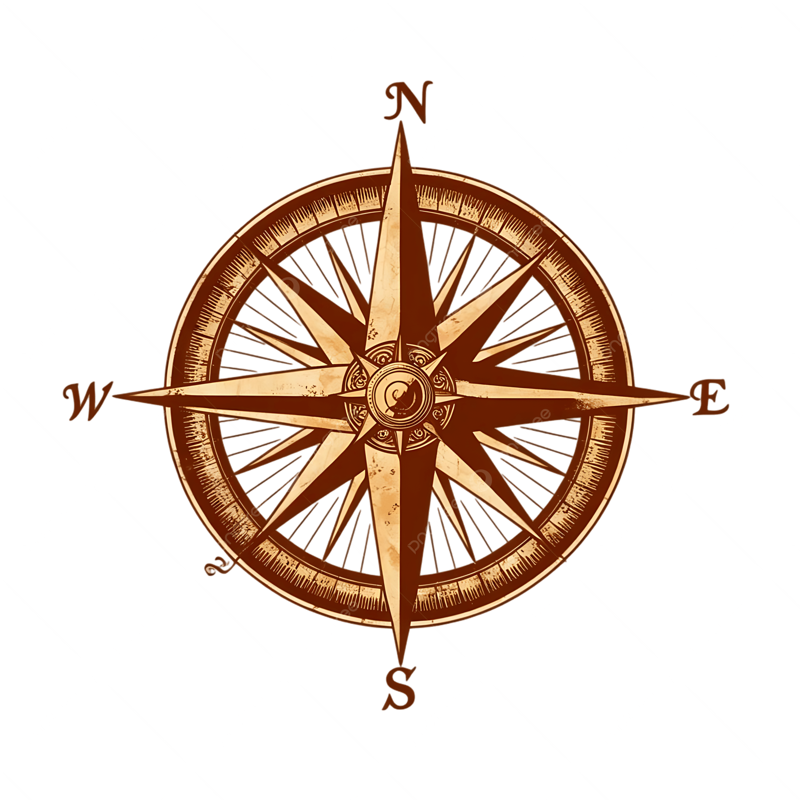

🧭 Compass App
<u>📖 Overview</u>
Compass is a Flutter-based mobile application that provides users with a digital compass, location services, mapping, and sunrise/sunset calculations. It leverages device sensors and geolocation to deliver accurate directional and environmental information. The app is designed for outdoor enthusiasts, travelers, and anyone needing navigation or location-based utilities.

<u>🚀 Features</u>
🧭 Digital Compass
Utilizes device sensors to show real-time direction.

📍 Geolocation
Fetches and displays your current location using GPS.

🗺️ Interactive Map
Visualizes your position on a map with support for zoom and pan.

🌅 Sunrise & Sunset Calculation
Calculates and displays daily sunrise and sunset times for your location.

🔦 Torch Control
Allows you to toggle your device's flashlight.

🔒 Permission Handling
Manages location and sensor permissions seamlessly.

💾 Shared Preferences
Stores user settings and preferences locally.

<u>📦 Dependencies</u>
The app uses the following main packages:

Package	Purpose
flutter_compass	Access device compass sensor
geolocator	Get device location
permission_handler	Handle runtime permissions
geocoding	Convert coordinates to addresses
sensors_plus	Access device sensors
sunrise_sunset_calc	Calculate sunrise/sunset times
flutter_map	Display interactive maps
latlong2	Handle latitude/longitude data
torch_controller	Control device flashlight
http	Make network requests
shared_preferences	Store data locally
<u>🛠️ Installation & Setup</u>
1. Clone the Repository

git clone <your-repo-url>cd compass
2. Install Dependencies

flutter pub get
3. Add Assets
Ensure the following asset exists:

compass_rose.png
If you add custom fonts, update the pubspec.yaml under the fonts: section.

4. Run the App

flutter run
<u>🗂️ Project Structure</u>

compass/├── assets/│   └── images/│       └── compass_rose.png├── lib/│   └── main.dart├── pubspec.yaml└── ...
<u>🔑 Permissions</u>
The app requests the following permissions:

Location (for GPS and mapping)
Sensors (for compass functionality)
Camera/Flashlight (for torch control)
Make sure to grant these permissions for full functionality.

<u>📝 Customization</u>
Assets:
Add more images to images and declare them in pubspec.yaml.

Fonts:
Add custom fonts in the fonts: section of pubspec.yaml.

<u>🧑‍💻 Contribution</u>
Fork the repository.
Create your feature branch (git checkout -b feature/YourFeature).
Commit your changes (git commit -am 'Add new feature').
Push to the branch (git push origin feature/YourFeature).
Open a Pull Request.
<u>❓ FAQ</u>
Q: Why is the compass not working?
A: Ensure your device has a magnetometer and permissions are granted.

Q: How do I add more assets?
A: Place them in images and list them under assets: in pubspec.yaml.

<u>📄 License</u>
This project is licensed for personal use. Remove publish_to: 'none' in pubspec.yaml if you wish to publish.

<u>📬 Contact</u>
For issues or feature requests, open an issue on GitHub.

  

Made with ❤️ using Flutter